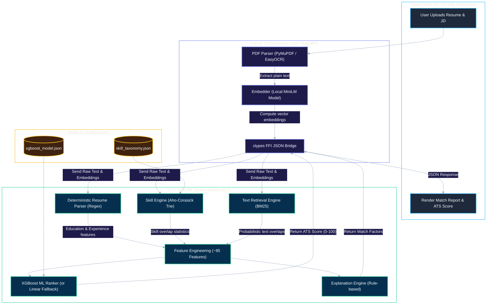
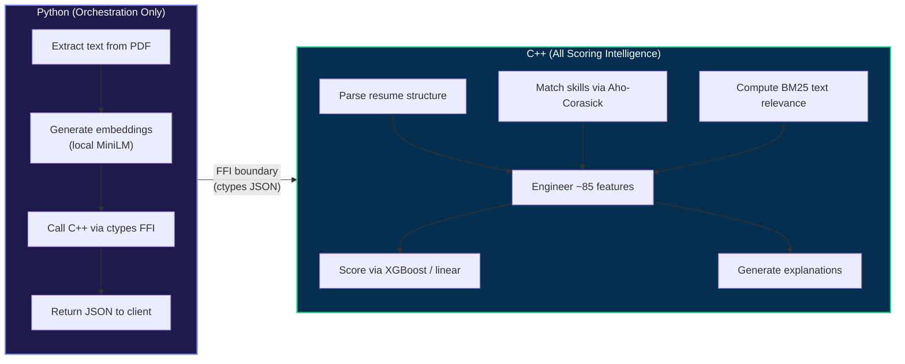
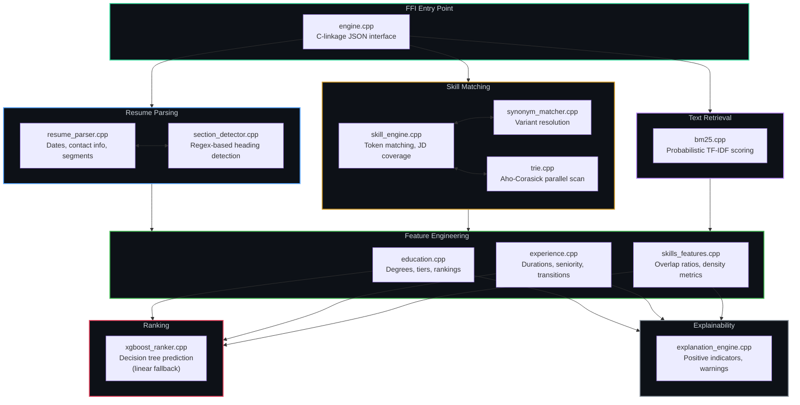

<div align="center">

# TalentMatch AI v2

**Production-grade Resume Ranking Engine — No LLM, No API Key**

[](https://talentmatch-ai-o22y.vercel.app/)
[](.)
[](cpp_core/)
[](https://python.org)
[](LICENSE)

<br/>

*Deterministic Scoring · Aho-Corasick Trie Matching · BM25 Retrieval · XGBoost Ranking*

*~85 engineered features computed natively in C++. Python handles only PDF extraction and embeddings.*

<br/>

[**Try the Demo →**](https://talentmatch-ai-o22y.vercel.app/) · [Architecture](#architecture) · [C++ Engine](#c-engine-core) · [Get Started](#getting-started)

---

</div>

> [!CAUTION]
> **Before using the live demo**, the backend must be woken up first (Render free tier spins down after inactivity).
> Visit the backend health endpoint to activate it, then use the demo:
>
> 1. **Activate backend →** [talentmatch-ai-backend-lsc2.onrender.com](https://talentmatch-ai-backend-lsc2.onrender.com/) *(wait for a response)*
> 2. **Then use the demo →** [talentmatch-ai-o22y.vercel.app](https://talentmatch-ai-o22y.vercel.app/)

> [!NOTE]
> v2 replaces the Groq/LLM-based pipeline with a **deterministic C++ ML engine**. All scoring intelligence runs natively in C++. Python is responsible only for PDF text extraction and embedding generation.

---

## Table of Contents

<details>
<summary><b>Click to expand</b></summary>

1. [Why TalentMatch AI](#why-talentmatch-ai)
2. [Architecture](#architecture)
3. [Sample Output](#sample-output)
4. [C++ Engine Core](#c-engine-core)
5. [Building](#building)
6. [Getting Started](#getting-started)
7. [Training the XGBoost Model](#training-the-xgboost-model-optional)
8. [What Was Removed (v1 → v2)](#what-was-removed-v1--v2)
9. [Project Structure](#project-structure)
10. [Contributors](#contributors)
11. [License](#license)

</details>

---

## Why TalentMatch AI

Most "AI resume matchers" are a thin prompt wrapped around a hosted LLM — slow, non-deterministic, and dependent on a third-party API key and rate limit. TalentMatch AI v2 takes the opposite approach:

| Principle | How It's Achieved |
|:---|:---|
| **Deterministic** | Same resume + JD always produces the same score. No prompt drift, no hallucinated skills |
| **Local-first** | Embeddings run on a local MiniLM model; scoring runs in native C++. Nothing leaves the machine unless you deploy it |
| **Fast** | Aho-Corasick trie matching, BM25 retrieval, and ~85 features computed natively — no round-tripping to a hosted model |
| **Explainable** | Every score ships with rule-based positive/negative factors, not an opaque LLM narrative |
| **Zero-config** | No `.env` file, no API key, no external service dependency to get a working scorer out of the box |

---

## Architecture

### End-to-End System Architecture



### What Python Does vs What C++ Does



> [!IMPORTANT]
> **Python does NOT compute any score.** Everything between the FFI boundary and the JSON response — parsing, skill matching, feature engineering, retrieval scoring, ranking, and explanation generation — runs natively in C++.

---

## Sample Output

```json
{
  "overall_score": 91.3,
  "scores": {
    "skills":         95.0,
    "experience":     87.0,
    "education":     100.0,
    "projects":       90.0,
    "semantic":       93.0,
    "resume_quality": 82.0
  },
  "matched_skills":       ["Python", "PostgreSQL", "Docker", "Kafka"],
  "missing_skills":       ["Terraform"],
  "partial_skills":       [
    {"jd_skill": "cloud deployment", "matched_as": "AWS", "confidence": 0.71}
  ],
  "top_positive_factors": [
    "Excellent skill match — 92% of required skills aligned",
    "Strong relevant experience — 6 yrs",
    "Strong semantic alignment with job description"
  ],
  "top_negative_factors": [
    "Missing required skills: Terraform",
    "Skill gap — only 87% of required skills found"
  ],
  "ranking_method": "linear_fallback"
}
```

The response includes **six sub-scores**, matched/missing/partial skill breakdowns, and rule-based positive and negative factors — all computed deterministically in the C++ engine.

---

## C++ Engine Core

TalentMatch AI v2 compiles all ATS scoring, feature engineering, and machine learning logic into a high-performance native C++ library. Python communicates with it via a lightweight ctypes FFI bridge.

### Engine Module Architecture



### Core Modules

<details>
<summary><b><code>engine.cpp</code></b> — FFI Entry Point</summary>

Entry API wrapper exposing standard C-linkage JSON interfaces. Declared in `include/engine.h` for Python ctypes binding.

</details>

<details>
<summary><b><code>parser/</code></b> — Deterministic Resume Parsing</summary>

| File | Purpose |
|:---|:---|
| `resume_parser.cpp` | Core parsing routines for dates, contact info, and document segments |
| `section_detector.cpp` | Scans headings using regex to identify document regions (education, experience, skills, etc.) |

</details>

<details>
<summary><b><code>skills/</code></b> — High-Performance Skill Matching</summary>

| File | Purpose |
|:---|:---|
| `skill_engine.cpp` | Evaluates raw text, normalized skills, and required JD coverage percentages |
| `synonym_matcher.cpp` | Resolves variants (e.g., "JS" → "JavaScript", "Postgres" → "PostgreSQL") |
| `trie.cpp` | Implements Aho-Corasick trie structures for parallel multi-pattern scanning |

</details>

<details>
<summary><b><code>retrieval/</code></b> — Classical Text Retrieval</summary>

| File | Purpose |
|:---|:---|
| `bm25.cpp` | Computes probabilistic TF-IDF and BM25 relevance scores between resume and JD text |

</details>

<details>
<summary><b><code>features/</code></b> — Feature Engineering (~85 features)</summary>

| File | Purpose |
|:---|:---|
| `education.cpp` | Scores academic degrees, institutional rankings, and tier classification |
| `experience.cpp` | Scores timeline durations, career transitions, and title seniority |
| `skills_features.cpp` | Calculates matched/missing keyword statistics, overlap ratios, and density metrics |

</details>

<details>
<summary><b><code>ranking/</code></b> — ML Ranking</summary>

| File | Purpose |
|:---|:---|
| `xgboost_ranker.cpp` | Performs decision-tree prediction from the ~85 feature vector; falls back to linear weights if no trained model is present |

</details>

<details>
<summary><b><code>explainability/</code></b> — Rule-Based Explanations</summary>

| File | Purpose |
|:---|:---|
| `explanation_engine.cpp` | Generates user-facing positive indicators and missing-skill warnings from feature values |

</details>

---

## Building

| Platform | Command |
|:---|:---|
| **Linux / macOS** | `chmod +x scripts/build_engine.sh && ./scripts/build_engine.sh` |
| **Windows** | `.\scripts\build_engine.ps1` *(requires Visual Studio 2022 with C++ workload + CMake)* |
| **Docker (recommended)** | `docker build -t talentmatch . && docker compose up` |

<details>
<summary><b>Manual CMake build</b></summary>

```bash
cd cpp_core
mkdir build && cd build
cmake .. -DCMAKE_BUILD_TYPE=Release
cmake --build . --config Release
```

</details>

---

## Getting Started

### Local Development (no Docker)

```bash
# 1. Build the C++ engine (required)
./scripts/build_engine.sh

# 2. Python setup
python -m venv .venv
source .venv/bin/activate   # Windows: .venv\Scripts\activate
pip install -r requirements.txt

# 3. Run the API
uvicorn api:app --host 0.0.0.0 --port 8000

# Or launch the Gradio UI:
python app.py
```

> [!TIP]
> No `.env` file or API key needed. The engine works out of the box with the deterministic linear fallback scorer.

### Run Tests

```bash
python -m pytest tests/ -v --no-header
```

> [!NOTE]
> Tests automatically skip C++ engine tests if the native library hasn't been built yet.

---

## Training the XGBoost Model (Optional)

The engine ships with a **deterministic linear fallback** scorer that works out of the box. To enable ML ranking via XGBoost:

```bash
# Install training dependencies
pip install xgboost scikit-learn

# Generate synthetic data and train (3000 samples by default)
python scripts/train_model.py

# With real labeled data:
python scripts/train_model.py --samples 10000 --output models/xgboost_model.json

# Rebuild with XGBoost support
./scripts/build_engine.sh --xgboost
```

---

## What Was Removed (v1 → v2)

```mermaid
flowchart LR
    subgraph V1["v1 — LLM-Dependent"]
        direction TB
        V1A["Groq API<br/>(llama-3.3-70b)"]
        V1B["LLM skill extraction"]
        V1C["HeuristicRanker<br/>(60/40 hardcoded)"]
        V1D["AI-generated narratives"]
        V1E["GROQ_API_KEY required"]
    end

    subgraph V2["v2 — Deterministic C++"]
        direction TB
        V2A["C++ regex parser"]
        V2B["Aho-Corasick trie<br/>+ fuzzy matching"]
        V2C["XGBoost / linear fallback"]
        V2D["Rule-based templates"]
        V2E["No API key needed"]
    end

    V1 ==>|"Replaced by"| V2

    style V1 fill:#1a1a2e,stroke:#f85149,stroke-width:2px,color:#eee
    style V2 fill:#1a1a2e,stroke:#3fb950,stroke-width:2px,color:#eee
```



| v1 (Removed) | v2 (Replaced With) |
|:---|:---|
| Groq API (`llama-3.3-70b`) for resume parsing | Deterministic C++ regex parser |
| LLM skill extraction | Aho-Corasick trie + fuzzy matching |
| `HeuristicRanker` (60/40 hardcoded weights) | XGBoost (or linear fallback) |
| AI-generated narrative explanations | Rule-based template explanations |
| `easyocr` for image PDFs | PyMuPDF native text extraction |
| `groq`, `tenacity`, `httpx` dependencies | Removed entirely |
| `GROQ_API_KEY` environment variable | Not required |

---

## Project Structure

<details>
<summary><b>Click to expand full project tree</b></summary>

```
talentmatch-ai-main/
├── api.py                            ← FastAPI endpoint: validates inputs, manages PDF parsing, runs inference
├── app.py                            ← Gradio UI for local developer testing
├── Dockerfile                        ← Docker build configuration
├── docker-compose.yml                ← Multi-container composition
├── requirements.txt                  ← Python dependencies
├── render.yaml                       ← Render deployment config
├── test_api.py                       ← FastAPI endpoint test script
│
├── cpp_core/                         ← Core ML scoring engine (C++)
│   ├── CMakeLists.txt                   CMake build configuration
│   ├── engine.cpp                       FFI entry-point (C-linkage JSON)
│   ├── include/
│   │   ├── engine.h                     DLL exports for ctypes
│   │   ├── features.hpp                 ~85 feature vector struct
│   │   ├── resume.hpp                   Parsed candidate profile schema
│   │   └── taxonomy.hpp                 Skill taxonomy map structures
│   ├── parser/
│   │   ├── resume_parser.cpp            Date, contact, segment parsing
│   │   └── section_detector.cpp         Regex-based heading detection
│   ├── skills/
│   │   ├── skill_engine.cpp             Token matching, JD coverage
│   │   ├── synonym_matcher.cpp          Variant resolution
│   │   └── trie.cpp                     Aho-Corasick trie
│   ├── retrieval/
│   │   └── bm25.cpp                     BM25 relevance scoring
│   ├── features/
│   │   ├── education.cpp                Academic scoring
│   │   ├── experience.cpp               Career timeline scoring
│   │   └── skills_features.cpp          Overlap and density metrics
│   ├── ranking/
│   │   └── xgboost_ranker.cpp           XGBoost / linear fallback
│   └── explainability/
│       └── explanation_engine.cpp       Rule-based factor generation
│
├── src/                              ← Python orchestration layer
│   ├── bridge.py                        ctypes FFI bridge to C++ DLL
│   ├── config.py                        Paths, batch sizes, logging
│   ├── devices.py                       Hardware detection (CUDA/MPS/CPU)
│   ├── pipeline.py                      Core workflow: extract → embed → score
│   ├── embeddings/
│   │   └── generator.py                 Local MiniLM embedding computation
│   ├── parsing/
│   │   ├── extractor.py                 PDF text extraction (PyMuPDF)
│   │   └── schema.py                    Pydantic response serialization
│   └── (legacy modules)                 v1 Python-side scoring (retained for reference)
│
├── frontend/                         ← Web UI (Vite)
│   ├── index.html                       Upload zones, score charts, match reports
│   ├── style.css                        Dark theme, responsive grid layout
│   └── main.js                          Upload handling, DOM updates, API calls
│
├── extension/                        ← Chrome browser extension
│   ├── manifest.json                    Extension permissions and config
│   ├── popup.html                       Extension popup interface
│   └── popup.js                         JD extraction, resume upload, API calls
│
├── scripts/                          ← Build and training automation
│   ├── build_engine.sh                  Linux/macOS build script
│   ├── build_engine.ps1                 Windows build script
│   └── train_model.py                   XGBoost training on synthetic data
│
├── models/                           ← ML model checkpoints
│   ├── xgboost_model.json               Trained decision trees
│   └── xgboost_model.features.json      Feature vector specification
│
└── tests/
    └── test_pipeline.py              ← End-to-end integration + FFI tests
```

</details>

---

## Contributors

| Contributor | Responsibilities |
|:---|:---|
| **Anshuman Pandey** | ML pipeline, C++ engine architecture, v2 refactor |
| **Arnav Shukla** | Hosting, deployment, live demo, Edge extension |

---

## License

MIT — see [`LICENSE`](./LICENSE).

---

<div align="center">

### No LLM. No API Key. No Prompt Drift.

*Deterministic C++ scoring engine · Aho-Corasick skill matching · BM25 retrieval · XGBoost ranking*

**Same resume + same JD = same score. Every time.**

<br/>

Star this repo if you found it interesting!

---

*Made by [Anshuman](https://github.com/AnshumanJ28) and [Arnav](https://github.com/Arnavshukla09)*

</div>
